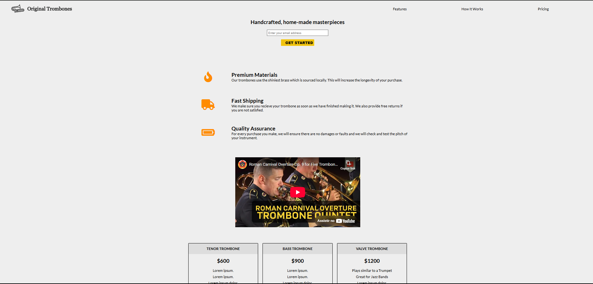

# 🎺 Product Landing Page

Welcome to the **Product Landing Page** repository! This project consists of a responsive landing page, developed with **HTML5** and **CSS3**, as part of **freeCodeCamp's** Responsive Web Design course. The goal is to practice creating promotional pages that highlight products in a clear and attractive way.​

## Layout

    

## 📋 Features

- **Responsive Design:** Adapts to different screen sizes, ensuring a good experience on mobile devices and desktops.

- **Informational Sections:** Includes sections such as "Features", "How it Works", and "Pricing" to provide detailed information about products.

- **Signup Form:** Allows users to sign up for updates or offers.

- **Smooth Navigation:** Navigation links that lead to specific sections of the page to facilitate usability.​

## 🛠️ Technologies Used

- **HTML5:** Semantic structuring of the page content.

- **CSS3:** Responsive page styling and layout.​